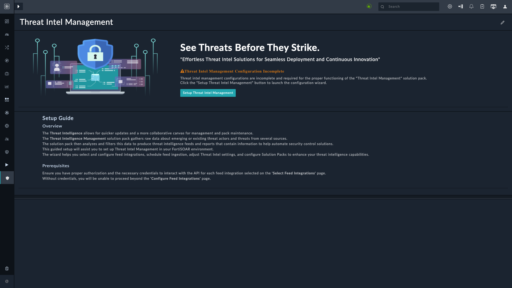
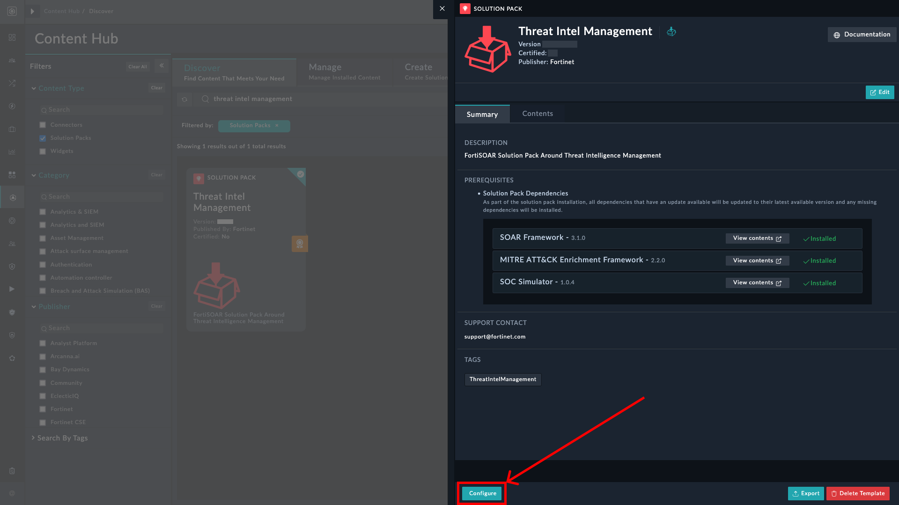
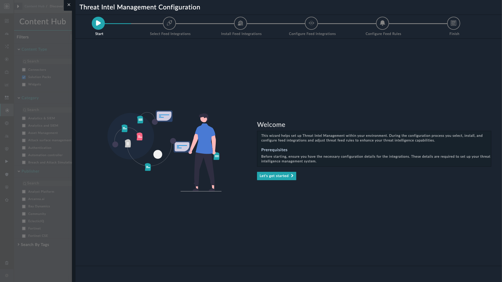
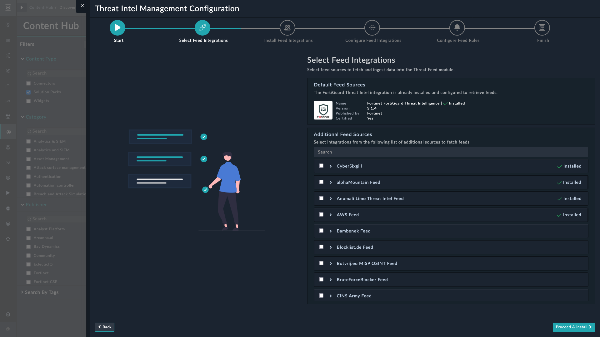
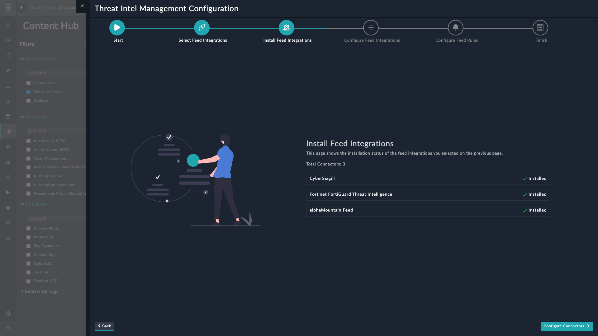
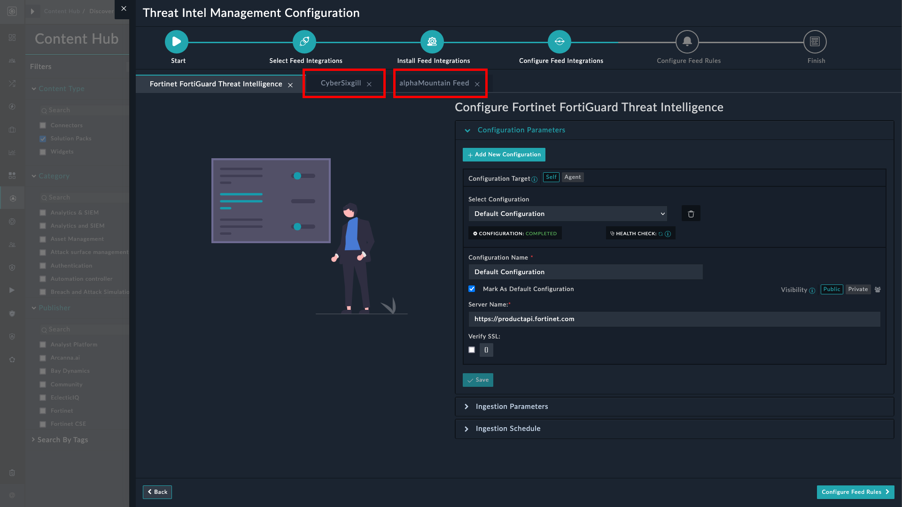
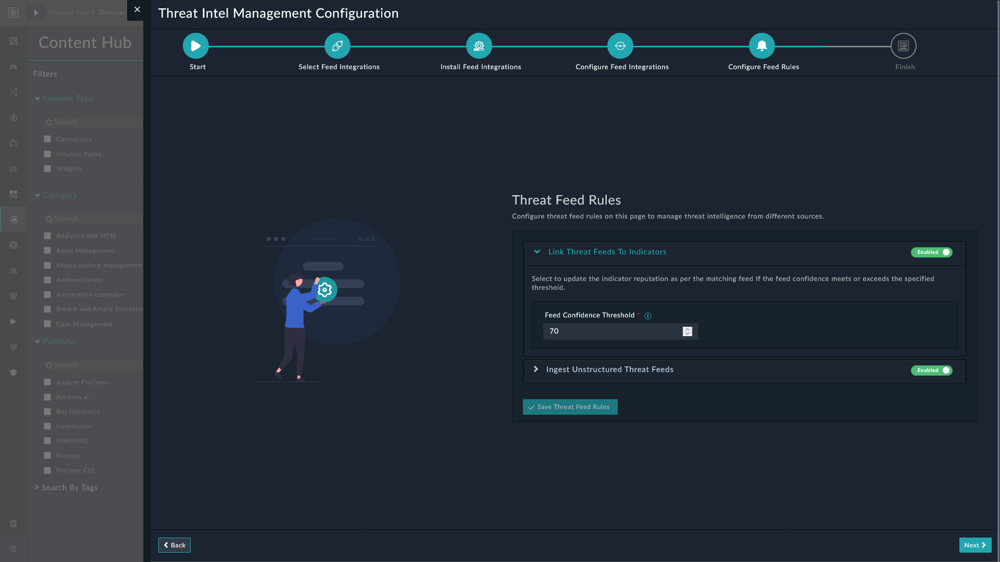

| [Home](../README.md) |
|----------------------|

# Installation

1. To install a solution pack, click **Content Hub** > **Discover**.
2. From the list of solution pack that appears, search for **Threat Intel Management**.
3. Click the **Threat Intel Management** solution pack card.
4. Click the **Install** button on the lower part of the screen to begin installation.

## Prerequisites

Threat Intel Management (TIM) Solution Pack requires the following solution packs to be pre-installed:

| Solution Pack Name                | Version          | Purpose                                                  |
|:----------------------------------|:-----------------|:---------------------------------------------------------|
| SOAR Framework                    | v2.1.1 and later | Required for Incident Response modules                   |
| MITRE ATT&CK Enrichment Framework | v2.2.0 and later | Required for Mitre Att&ck modules                        |
| SOC Simulator                     | v1.0.2 and later | Required for scenario module and SOC Simulator Connector |
| Vulnerability Management          | v2.1.0 and later | Required correlate CVEs in Threat Reports                |

# Configuration

For optimal performance of **Threat Intel Management** solution pack, you can install and configure:

- The FortiRecon ACI connector with its ingestion set up to ensure ingestion of FortiRecon ACI data in threat mitigation environment.
    - To configure and use the FortiRecon ACI connector as a source of Adversary Centric Intelligence(ACI) information, refer to [Configuring FortiRecon ACI](https://docs.fortinet.com/fortisoar/connectors/fortirecon-aci).

- The Exchange connector with email ingestion setup to ensure regular ingestion of threat feeds from email attachments.
    - To configure and use the Exchange connector, refer to [Configuring Exchange](https://docs.fortinet.com/fortisoar/connectors/exchange).

## Setup Threat Intel Management on FortiSOAR

To leverage the power of Threat Intel Management solution pack, configuring threat intel feeds, integrations, and feed processing rules is an essential first step. A new configuration wizard streamlines the process.

You can launch the configuration wizard after installation of the Threat Intel Management solution pack by any of the following methods:

1. Threat Intel Management navigation menu

2. Threat Intel Management's Content Hub Page

### Navigation Menu

1. Navigate to **Threat Intel Management** > **Threat Intel Feeds**.

    

2. Click the button **Setup Threat Intel Management**.

### Content Hub Page

After installation, the configuration wizard launches automatically.

If you chose to skip the configuration wizard after installation, you can re-launch the configuration wizard as follows:

1. Launch **Content Hub** and search for **Threat Intel Management** on Content Hub.
2. Click the **Threat Intel Management** solution pack card.
3. Click the **Configure** button to view the wizard welcome screen.

    

### Selecting Feed Sources

This page of the Threat Intel Management configuration wizard helps select integrations from where to fetch threat intel feeds.

- The **Fortinet FortiGuard Threat Intelligence** connector is installed with the solution pack and is listed under **Default Feed Sources**.

- Other installed connectors, capable of fetching threat intel feeds, are listed under **Additional Feed Sources**.

    - Additional connectors, if installed, are marked as ** Installed**. Scroll the pane to view other connectors capable of fetching threat feeds.
    - Expand each listed connector to view its *Version*, *Publisher*, and if the connector is *Certified* by Fortinet.
    - To add more feed sources, you can choose from the pre-populated list or use the search bar to search for specific feeds.
    - Select the connectors to mark them for installation.
    - Once selected, click the button **Proceed & Install** to begin installation of selected connectors.

## Installing Feed Sources

This page of the Threat Intel Management configuration wizard displays the installation status of the connectors selected for installation in the *Select Feed Integrations* screen.

Click the **Configure Connectors** button to proceed.

## Configuring Feed Sources

This page of the Threat Intel Management configuration wizard helps configure feed integrations selected in *Select Feed Integrations* page and installed in *Install Feed Integrations* page.

> [!NOTE]
> **Fortinet FortiGuard Threat Intelligence** is already configured for use out-of-the-box.

- You need to configure all integrations selected for installation. The integration can be configured on the target either as **Self** or **Agent**.
    - Completion of the integration health check triggers a new system playbook collection for each integration. This collection includes data ingestion playbooks copied and activated from the corresponding integration playbook sample collection
    - A new schedule for the ingestion playbook, based on the corresponding data ingestion playbook collection, ensures automatic execution of the associated playbooks based on a **Cron** expression set to **`Hourly`**. So the feeds are ingested and fetched from the relevant integrations every hour.
    - You can click to close any integration's tab that you do not prefer to configure:

        

>[!NOTE]
> For each configured integration, mark at least one configuration as **Default**.

-  **Ingestion Parameters**: The ingestion parameters are retrieved from the configuration schema within the fetch playbook located in the data ingestion playbook collection. The ingestion parameters for each integration varies.

    The following parameters help adjust and save the fetch playbook configurations for use while creating the threat feeds, for **Fortinet FortiGuard Threat Intelligence**:
    - **Confidence**: Specify the confidence score to assign to the ingested feeds.
    - **Reputation**: Select the reputation to assign to the ingested feeds.
    - **TLP**: Select the TLP to assign to the ingested feeds.
    - **Expiry**: Specify the age of the feeds in days.

- **Ingestion Schedule**
    - By default, the schedule is set to **Hourly**. To change the schedule, specify a `Cron` expression for the schedule or select some other frequency (*Daily*, ).

- Similarly, configure and specify parameters for each *installed* feed integration by clicking their respective tabs.

- Click the button **Configure Feed Rules** to set up and configure the threat feed rules.

> [!NOTE]
> The ingestion parameters and ingestion schedule become available only when the configuration health check completes.

## Configuring Feed Rules

We have introduced **Threat Feed Rules** to better leverage ingested feeds. These rules offer a structured framework for processing and analyzing threat feeds, thereby improving the overall functionality of the **Threat Intelligence Management** solution pack.

You can configure the following feed rules to manage threat intelligence feeds from various sources:

- Linking Threat Feeds to Indicators
- Ingesting Unstructured Threat Feeds

### Linking Threat Feeds to Indicators

Enable this rule and specify a feed confidence threshold to automatically update the matching indicator record reputation.

**Confidence Threshold**: Specify a feed confidence threshold to link feeds, with confidence threshold equal to or greater than the specified value, to the indicator.

For example, if you set this value to 70, all feeds with a confidence level equal to or greater than 70 link to the indicator and update its reputation as per the feed.

> [!NOTE]
> Reputation for indicators created after the feeds ingestion are updated.

### Ingesting Unstructured Threat Feeds

Enable this rule to ingest unstructured threat feeds from file sources and email communications. This rule extracts critical threat feeds from unstructured data sources and automatically ingests it into the Threat Intel Feeds module.

Once enabled, you can further fine-tune the rule by defining the following parameters:

- **Ingest Threat Feeds from Files**: Select to ingest unstructured threat feeds by uploading a file. Supported file formats are `csv`, `txt`, `pdf`, `eml`, `json`, and `xlsx`. Refer to the section [Importing Feeds from Files](./usage.md#importing-feeds-from-files) under *Usage* for more information.
 
- **Ingest Threat Feeds from Email Attachments**: Select to ingest unstructured threat feeds from email attachments.
    - **Email Server**: Select an email server from which to ingest emails. Currently, only *Exchange* is supported.
    - **Email Folder** : Specify the mailbox folder that contains all emails with feed attachments.

> [!NOTE]
>- Attachments of only unread emails are ingested, hence we recommend that you create a separate folder for emails with feed attachments with mailbox rules in place to redirect all such emails to this folder.
>- The feeds are extracted only from attachments and not from the subject line or email body.
 
- **Ingestion Parameters**
    - **Confidence**: Specify the confidence score to assign to the ingested unstructured threat feeds.
    - **Reputation**: Select the reputation to assign to the ingested unstructured threat feeds.
    - **TLP**: Select the TLP to assign to the ingested unstructured threat feeds.
    - **Maximum Age (in days)**: Specify the age of the ingested unstructured threat feeds, in days.
    - **Source**: Specify a value to be updated as *Source* for all ingested unstructured threat feeds.
    - **Tags**: Specify comma-separated values to be assigned as tags to the ingested unstructured threat feeds.

- **Email Ingestion Schedule**: Specify the frequency at which unstructured threat feeds are ingested from emails. This schedule will then automatically run at the specified frequency to ingest unstructured threat feeds. For example, if you want to ingest emails every 5 minutes, click **Every X Minute**, and in the **minute** box enter `*/5`. This means that emails are ingested every 5 minutes.
    - **Timezone**: Select a timezone in which to export the report. Default is *`UTC`*.

- **Block Threat Feeds Automatically**: Select this option to block threat feeds immediately on ingestion.

- Click the button **Save** to save the changes.

For more information, refer to the [Threat Feed Rules](./threat-feed-rules.md) document.

- Click the button **Next** button to view the Configuration Summary on the **Finish** page.

## Finish

This page, apart from summarizing the configuration changes, also set in motion the following:

- MITRE&reg; integration's data ingestion is triggered resulting in MITRE&reg;'s records like Techniques, Subtechniques, etc. to be ingested into FortiSOAR&trade;

- The following default data-sets are created:

    - FortiGuard Outbreak Threat Feeds
    - Phishing Threat Feeds
    - FortiGuard Threat Intel Feeds
    - Block List (Domain)
    - Block List (IP Address)
    - Block List (URL)

These data-sets can be viewed and managed from **Threat Intel Management** > **Threat Intel Feed**.

# Next Steps

| [Usage](./usage.md) | [Contents](./contents.md) |
|---------------------|---------------------------|