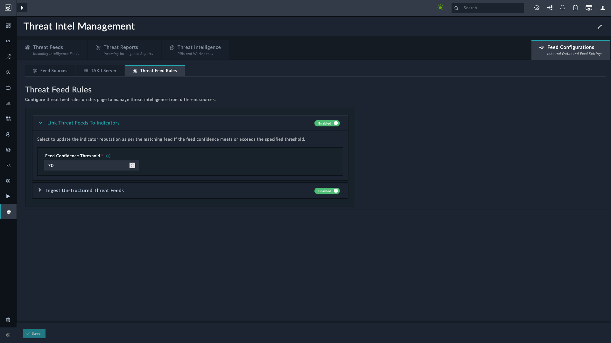
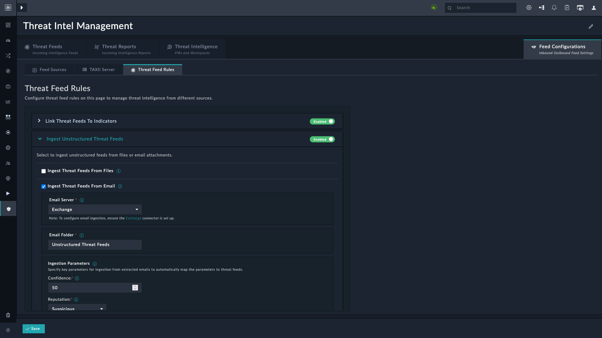

| [Home](../README.md) |
|----------------------|

## Overview

We have introduced **Threat Feed Rules** to help work with the ingested threat feeds. Ingesting threat feeds, which contain critical data about potential security threats, is a key part of any threat intelligence platform. However, simply ingesting the data is not enough to extract actionable insights. Without proper processing and analysis, this data can be overwhelming and difficult to use effectively.

**Threat Feed Rules** address this challenge by providing a structured and systematic approach to managing these feeds. These rules help you define specific criteria and conditions for how threat data should be processed. For example, you can set rules to filter, categorize, or prioritize certain types of threats based on predefined patterns or attributes.

This structured framework also enhances automation in threat analysis. Once the rules are set, the system automatically processes incoming feeds and applies these rules to generate insights or trigger responses. **Threat Feed Rules** significantly improve the overall functionality of the **Threat Intelligence Management** solution pack by streamlining the analysis and subsequent action on threat data. They help ensure that the platform becomes not just a repository of information, but a powerful tool that enhances the user's ability to detect, analyze, and respond to potential security threats with greater accuracy and speed.

## Linking Threat Feed to Indicator

The **Link Threat Feed to Indicators** rule helps automate the process of associating threat feed data with the corresponding Indicators of Compromise (IOCs) in your system. By configuring a **Feed Confidence Threshold**, this rule automatically updates the reputation of matching indicators based on the confidence level of the incoming threat feed.

This section explains a possible flow when this rule is set.

1. **Ingesting Indicators**
    1. Threat feeds from external sources (such as commercial or open-source threat intelligence providers) are ingested into the system.
        - Each feed comes with:
            - **Indicators**: Indicators comprising of IP addresses, domains, URLs, etc.
            - **Confidence score**: A measure of how reliable the feed is.
            - **Reputation score**: A categorization of the feed’s threat level (For example: `High`, `Medium`, or `Low`).
    2. Alerts ingested from various sources such as a SIEM or an EDR. Indicator records are created from the extracted indicators.

2. **Matching Indicator records to Threat Feeds**: Indicator records in the system are matched with the indicators in threat feeds.

3. **Checking Feed Confidence Threshold**: The rule compares the confidence score of the threat feed with the **Feed Confidence Threshold** that you have configured, `70` for example.

4. **Updating Reputation**: If the threat feed has a confidence equal to or greater than *Feed Confidence Threshold*, the indicator's reputation is updated to match the reputation in the threat feed.

## Ingesting Unstructured Threat Feeds

The **Ingest Unstructured Threat Feeds** rule helps automate the ingestion and processing of unstructured threat data from files and email attachments. Unstructured threat data often comes in the form of raw, unorganized information that lacks a predefined format, which can make it difficult to parse and analyze manually.

By implementing this rule, the system can automatically parse and analyze the unstructured data, extracting valuable threat intelligence from these sources. The result is the creation of structured threat feeds that improve detection capabilities and provide a comprehensive view of the threat landscape.

Once enabled, refer to the section [Importing Feeds from Files](./usage.md#importing-feeds-from-files) to upload and ingest unstructured threat feeds from files.

### Ingesting Threat Feeds from Email Attachments

Select **Ingest Threat Feeds From Email** to enable automatic ingestion of unstructured threat feed data from *unread* email attachments.

> [!NOTE]
> The Exchange connector must be configured to ingest threat feed attachments from emails. For information on configuring the Exchange connector, refer to the [**Configuration Parameters**](https://docs.fortinet.com/document/fortisoar/4.5.1/exchange/961/exchange-v4-5-1#configParam) section in Exchange connector documentation.

> [!TIP]
> Create a rule on your email server to move all incoming emails, containing threat feed attachments, to another email folder. Ensure that all such emails are marked as **Unread**.

1. Select the mail server. Currently, only **Exchange** is supported.
2. Specify the name of the email folder designated to keep emails containing threat feed attachments.
3. Specify the **Ingestion Parameters**:
    - **Confidence**: Specify the confidence score to assign to the ingested unstructured threat feeds.
    - **Reputation**: Select the reputation to assign to the ingested unstructured threat feeds.
    - **TLP**: Select the TLP to assign to the ingested unstructured threat feeds.
    - **Maximum Age (in days)**: Specify the age of the ingested unstructured threat feeds, in days.
    - **Source**: Specify a value to be updated as *Source* for all ingested unstructured threat feeds.
    - **Tags**: Specify comma-separated values to be assigned as tags to the ingested unstructured threat feeds.
4. Specify **Email Ingestion Schedule**:
    - Select the frequency at which unstructured threat feeds are ingested from emails. This schedule will then automatically run at the specified frequency to ingest unstructured threat feeds. For example, if you want to ingest emails every 5 minutes, click **Every X Minute**, and in the **minute** box enter `*/5`. This means that emails are ingested every 5 minutes.
    - **Timezone**: Select a timezone in which to export the report. Default is *`UTC`*.

5. **Block Threat Feeds Automatically**: Select this option to block threat feeds immediately on ingestion.

6. Click the button **Save** to save the changes.

# Next Steps

| [Usage](./usage.md) | [Contents](./contents.md) |
|---------------------|---------------------------|