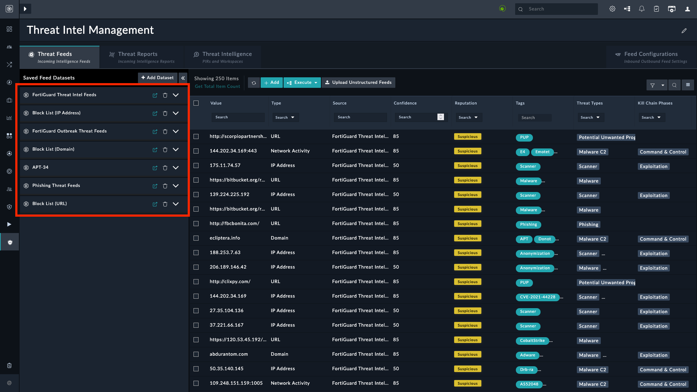

| [Home](../README.md) |
|----------------------|

# Usage

FortiSOAR's new **Threat Intel Management** Solution Pack brings Security Orchestration and Automated Response (SOAR) and Threat Intel Management (TIM) worlds closer by introducing advanced Threat Intel Management capabilities within the SOAR platform. The following video demonstrates how this integration greatly simplifies investigations by bringing in contextual threat intel.

|  |
|:--------------------------------------------------------------------------------------------------------:|
|             [FortiSOAR Threat Intel Management](https://www.youtube.com/watch?v=vTvtHQxniVU)             |

## Threat Feed Management and FortiGuard Integration

Using comprehensive, ingestion-friendly feed integrations for multiple paid and open-source third-party feeds (available in FortiSOAR Content Hub), threat intelligence teams can now ingest varied feed data and manage them in a normalized, single pane of glass using the 'Threat Feeds' Module. The solution provides multiple ways to manage this volume of data by parameters such as feed and source confidence, TLP, severity, Expiry/Age, etc. Additionally, the solution helps create feed datasets to filter and group relevant feeds for use in sharing, exporting, or eventually as useful data reference while creating contextual threat intelligence.

Another big value-added feature of the solution is its comprehensive integration with FortiGuard, Fortinet's flagship threat intelligence source. As part of the FortiSOAR TIM Solution, you get unlimited lookups into the rich FortiGuard threat intelligence database and the ability to ingest its valuable daily threat intelligence feed. In the 'Preview' mode, you can ingest a maximum of 100 feeds daily.

## Collaborative Framework To Create & Consume Actionable Threat Intelligence

Both incident response teams and organization members in and outside the SOC (executives, stakeholders, management) can raise Priority Intelligence Requirement (PIR) requests that drive threat intelligence-gathering efforts. The process starts with any SOC member raising a PIR with "*I need more information around this area/problem/artifact/actor, etc.*", followed by the SOC/threat intel team setting up workspaces in the Framework. A workspace is a goal-driven canvas that allows teams to dive into different phases of the threat intelligence lifecycle (direction, data collection, processing, analysis, dissemination, and feedback) to curate and share the process outcome with the stakeholder who asked for information. Threat feeds and datasets, MITRE ATT&CK Framework's rich actor (tactics, techniques, tools, etc.) information and integration fuel FortiSOAR's automation engine, and FortiSOAR's multi-dimensional correlation framework form a great combination of the right data sources and tools to start one's research.

## Sharing Threat Intelligence

The ability to generate and share the threat intelligence report with stakeholders enables making research actionable. A feedback loop is incorporated into the process to ensure the research meets the expected outcomes and allows for a dialogue between the request initiator (PIR owner) and the research team to get close to the goal. 

Additionally, the solution allows sharing of threat feeds and datasets over standard STIX/TAXII protocols for getting them across to products that can benefit from these threat feeds and datasets. For example, you can set up a TAXII server in FortiSOAR to broadcast relevant malicious and high-confidence feed datasets to a SIEM product such as Fortinet FortiSIEM, which eventually uses them to enhance detection rules and lookup watchlists. These datasets could also be sent using different integrations to update specific watchlists in these products.

## Feed Relationship Indicators

The solution is intelligent to auto-link malicious feeds with good confidence (configurable) with an indicator in the product and, if asked for, also update the indicator reputation. Such built-in intelligent workflows enable the consumption of feed intelligence while also improving the quality of daily investigations. There are several other handles, configurations, and options provided to manage the relationship between indicators and feeds in terms of feed confidence, sightings, similarities, and other parameters.

## Flow of Threat Intelligence Management

Once the TIM solution pack is installed, you must configure your threat intelligence feeds connectors such as Fortinet FortiGuard Threat Intelligence, Anomali Limo Threat Intel Feed, Cisco Talos Feed, MITRE ATT&CK, etc. based on your requirements, and then start ingesting data from these sources.

For information on how to configure feed connectors, see the connector documentation on the [FortiSOAR Connectors](https://docs.fortinet.com/fortisoar/connectors) page.

### Dashboards

Once you have configured data ingestion and are receiving feeds from various sources, navigate to the Dashboard page by clicking **Threat Intel Management** in the left navigation.

The *Dashboard* provides you with insights into the ROI, effectiveness of ingestion, ingestion rates of feeds, how many observables were ingested, how many of the ingested observables got linked to indicators, and the relevance of the feed sources, etc. These metrics enable you to decide which threat feeds are worth monitoring and the performance of the various threat feeds.

The *Feed Ingested* dashboard component reflects statistics for Threat Intel Feeds ingested in the *Last 15 days*, while the *Ingestion Volume* component shows the active feeds.

> [!NOTE]
> This dashboard can also be accessed from **Dashboards** > **TIM Overview and ROI**.

### Threat Intel Feed

Using a wide variety of feed integrations that are available on the **Content Hub**, you can seamlessly ingest feeds and get a normalized and aggregated view of the feeds on the **Threat Feeds** tab:

The Threat Feeds solution is well-architected to handle scale at one end and effectively manage feeds at the other. You can manage feeds with the help of parameters such as feed sources, their confidence, TLPs, expiry, etc.

The noise associated with the feeds is the main hurdle to managing feeds and deriving utility from the feeds. Therefore, as a first-level of filtration, the TIM solution allows you to create *Datasets*. To view datasets, click the **Manage Datasets** arrow to view the created datasets or to add new datasets:  

Similarly, you can create multiple datasets based on your goals or filtration requirements, and use them while you are creating actionable threat intelligence.

With **FortiSOAR 7.2.2 and later**, the **Threat Intel Feeds** module better tracks the date and time at which the feeds were ingested or updated into the FortiSOAR instance.

Enabling the **Trackable** checkbox under *Threat Intel Feed* module settings makes the following fields available in the Threat Intel Management's Threat Feed tab:
- Created On
- Created By
- Modified On
- Modified By

The time of the creation of feeds at intel source appears under the field *Created at Source*. Similarly, *Modified at Source* shows the time of modification at the intel source.

### Feed Configurations

The Feed Configuration tab contains settings for easy feed management and dissemination. It has following tabs:

- **Feed Sources**: Directs you to a Content Hub page that lists and helps install connectors that can fetch threat intel feeds.
- **TAXII Server**: Enables a TAXII Server to generate an outgoing feed based on the threat intelligence *Dataset* you wish to share externally. Once set up, TAXII clients can subscribe to the collection and receive the shared feeds in real-time.
- **Threat Feed Rules**: Helps manage incoming threat feeds through rules. For more information, refer to the [Configuring Feed Rules](./setup.md#configuring-feed-rules) section.

### Importing Feeds from Files

1. Enable the option **Ingest Threat Feeds From Files** under **Feed Configurations** > **Ingest Unstructured Threat Feeds** and click **Save**.

> [!NOTE]
> The Threat Intel Management configuration wizard must be completed.

2. Navigate to **Threat Intel Management** > **Threat Feeds Tab**.

3. Click the button **Upload Unstructured Feeds**.

    

4. Under **File to Import**, click to browse and upload the file. Supported file formats are `csv`, `txt`, `pdf`, `eml`, `json`, and `xlsx`.

5. **Confidence**: Specify the confidence score to assign to the ingested unstructured threat feeds.

6. **Reputation**: Select the reputation to assign to the ingested unstructured threat feeds.

7. **TLP**: Select the TLP to assign to the ingested unstructured threat feeds.

8. **Feed Expiry**: Specify the number of days after which the ingested unstructured threat feeds are marked as expired for deletion.

8. **Feed Source**: Specify a value to be updated as *Source* for all ingested unstructured threat feeds.

9. **Tags**: Specify comma-separated values to be assigned as tags to the ingested unstructured threat feeds.

10. Select the option **Automatic Block IOC** to block threat feeds immediately on ingestion. Leave unchecked to manually block threat feeds later.

## Using Data from a TAXII Server Feed  

This section explains how to use data from a TAXII server's feed to retrieve threat intelligence. As soon as you enable the TAXII server from **Threat Intel Management** > **Threat Intel Feed** > **Feed Configurations** > **TAXII Server** tab, the following details appear under **TAXII Server Details**:

### TAXII Server Details  

- **Server Address**:  
  `*https://[server_address]/api/taxii/1/*`  

- **Server Discovery Address**:  
  `*https://[server_address]/api/taxii/1/taxii*`  

- **Authentication**:  
  Use one of the following methods to authenticate your API requests:  

  1. **API Key Authentication (Recommended)**  
     Use the API Key as described in the *Authentication API Guide*.  

  2. **Custom Headers**  
     If the tool does not support custom headers, use the following credentials:  
     - Username: `*X-API-KEY-[api_key_name]*`
     - Password: `*[api-key]*`

  3. **Basic Authentication**  
     Use the username and password combination or include the credentials directly in the server address:  
     `*https://[username]:[password]@[server_address]/api/taxii/1/*`

>[!Note]  
>The basic authentication URL cannot be used directly in a browser. It must be used in a tool or script that supports such authentication methods.

### Available Endpoints  

The TAXII server provides the following endpoints to access datasets and feeds:  

- **List all datasets**  
  Endpoint: `/api/taxii/1/collections`  

- **Get dataset details**  
  Endpoint: `/api/taxii/1/collections/<datasetId>`  

- **List threat feeds in a dataset**  
  Endpoint: `/api/taxii/1/collections/<datasetId>/objects`  

- **Get details of a specific feed object**  
  Endpoint: `/api/taxii/1/collections/<datasetId>/objects/<objectId>`  

### Consuming Data from Datasets  

To access and consume data from multiple datasets:  
1. Authenticate with the TAXII server using the recommended API Key authentication.  
2. Use the `/collections` endpoint to list all available datasets.  
3. Retrieve dataset details and list objects in a dataset using the appropriate endpoints.  
4. Evaluate and consume threat intelligence data according to your organization's requirements.  

For more information on authentication and data usage, refer to the [*Authentication API Guide*](https://docs.fortinet.com/document/fortisoar/7.6.1/api-guide/846127/overview#Authentication).  

## Example - Export a CSV's Specific Fields to FortiGate

FortiGate accepts a list of indicators in CSV format. The CSV file must contain only the `value` field in the CSV file exported from FortiSOAR. The following steps help export a CSV file from FortiSOAR's Threat Intel Management module for importing in FortiGate.

### Create a Dataset

1. Navigate to **Threat Intel Management** > **Threat Intel Feed** from the FortiSOAR menu.
2. Select the tab **Threat Feeds**.
3. Click the button **+ Add Dataset**.

    

4. Enter the **Dataset Label** and **Filter Criteria**.

    

5. Click **Save Dataset**.

### Configure Feeds

1. Navigate to **Threat Intel Management** > **Threat Intel Feed** from the FortiSOAR menu.
2. Select the tab **Feed Configurations** on the upper-right part of the screen.
3. Under the **Feed Configurations** tab, select the tab **Outgoing Feed**.
4. Set the **Status** to **Enabled**.
5. Under **Available Datasets**, click the CSV icon to copy the endpoint URL of a dataset. The URL is of the following format:

    *`https://[server_address]/api/taxii/1/collections/<collection-ID>/objects?$format=csv&$limit=1000`*

    The CSV obtained has multiple comma-separated fields like `confidence`, `validFrom`, `validUntil`, `lastSeen`, and `value`. FortiGate requires only the `value` field in a CSV format that can be obtained by appending `$__selectFields=value` to the URL.

>[!TIP]
>To obtain multiple fields in a CSV format, separate the field with a comma. For example, appending `$__selectFields=value,confidence` to the URL returns the value (domains in our example) and their confidence score received from the Threat Feeds.

### Import the Feeds in FortiGate

1. Log in to FortiGate.
2. Navigate to **Security Fabric** > **External Connectors**.
3. Click the button **+ Create New**.

    

4. Scroll down to **Threat Feeds** and select **Domain Name**.
    
    >**NOTE**: When [creating a dataset](#create-a-dataset), we specified *Domain* as *Type*. Hence, we choose **Domain Name** in FortiGate.

    

5. Enter the name of this connector.
6. Enter the endpoint URL that fetches only the value.
7. Enable **Basic Authentication** and enter FortiSOAR login credentials for the endpoint URL.
8. Enter a time interval in the **Refresh Rate** field to fetch feeds from the endpoint URL.
9. Enable the **Status** toggle.
10. Click **OK** to save the config.

### View Entries in FortiGate

1. Log in to FortiGate.
2. Navigate to **Security Fabric** > **External Connectors**.
3. Hover over the card you just created and select **View Entries**. It shows the domains that you have imported along with their validity.

With this, the domains retrieved from the Threat Intel Management feed is imported into FortiGate for it to initiate action. Similarly, we can use this example to get the list of IP addresses and URLs.

## Importing Threat Feeds using FortiRecon ACI

Data ingestion capabilities built in FortiSOAR&trade; help **Threat Intel Management** solution pack import threat reports from FortiRecon ACI. This integration enhances the overall security posture and strengthens the organization's ability to detect and respond to cyber threats effectively.

Following section elaborates on how to observe Threat Intel Management solution pack's functioning using a scenario.

The section [Ingesting Threat Intel Reports from FortiRecon ACI](#ingesting-threat-intel-reports-from-fortirecon-aci) explains how to set up FortiRecon ACI for importing threat intel reports in Threat Intel Management solution pack.

### Scenario - Threat Intel Report

Before running the scenario, ensure that you have the MITRE connector configured. For information on how to configure Mitre connector, refer to [Configuring MITRE connector](https://docs.fortinet.com/document/fortisoar/2.0.2/mitre-att-ck/469/mitre-att-amp-ck-v2-0-2#Configuring_the_connector).

Refer to [Simulate Scenario documentation](https://fortisoar.contenthub.fortinet.com//detail.html?entity=socSimulator&version=1.0.2&type=solutionpack) to understand how to simulate and reset scenarios.

To understand the process FortiSOAR&trade; follows to respond to threat intel reports with *Technical Intelligence* as the *Source Category*, we have included a scenario &mdash; **Threat Intel Report** &mdash; with this solution pack.

This scenario generates an example Threat Intel Report with Technical Intelligence as Source Category **Threat Intel Management** module.

Navigate to the demo Threat Intel Report and note the following:

- The demo threat intel report created is an example of a FortiRecon ACI threat report
- The threat intel report has Source Category as *Technical Intelligence*

    

- The reported threat intel report contains the following information:
    - TLP
    - Relevance Rating
    - Information Reliability
    - Source Reliability
    - Source Name
    - Source Category
    - Type
    - Status
    - Motivation
    - Information Date
    - Publish Date

- Associated indicators from the Threat Intel Report are extracted and added in Threat Intel Feeds. All Threat Intel Feeds correlate with Threat Intel Report.   

- Threat Intel Report's *Adversary* is validated with *Mitre Associated Groups* and linked to associated Group, Related Techniques, Sub-Techniques and Software to that Threat Intel Report.

    

### Ingesting Threat Intel Reports from FortiRecon ACI

For a seamless data mapping with FortiSOAR&trade;'s modules during the FortiRecon ACI data ingestion process, ensure to install the **Threat Intel Management** solution pack before configuring ingestion of Threat Feeds from FortiRecon ACI.

Following steps outline the process to follow when ingesting threat reports from FortiRecon ACI into Threat Intel Management solution pack.

1. Install the Threat Intel Management solution pack. For information on how to install this solution pack, refer to [Installation](./setup.md#installation) section.

2. Configure the FortiRecon ACI connector. For information on how to configure this connector, refer to the *Configuration* section in [FortiRecon ACI Connector documentation](https://docs.fortinet.com/fortisoar/connectors/fortirecon-aci).

3. Configure data ingestion for the FortiRecon ACI connector. For information on how to configure data ingestion for this connector, refer to the *Data Ingestion* section in [FortiRecon ACI Connector documentation](https://docs.fortinet.com/fortisoar/connectors/fortirecon-aci).

4. To access the threat intel reports ingested through FortiRecon ACI, open the **Threat Intel Management** menu from the left and click the **Threat Reports** tab.

5. Click open a report and observe the following:
    
    1. The **Report Details** sections displays reliability and source of this report.

    2. **Threat**, **Adversary**, **Industry Tags**, and **Geography** in JSON format.

    3. A **Visual Correlation** section depicting the correlation of this threat intel report with threat intel feed.

    4. The **Threat Feeds** tab containing indicators and their type.

    5. Click to open each indicator and the description contains more information related to that indicator.

### Ingesting Threat Intel Reports from FortiGuard

### Threat Intelligence Workflow

The **Threat Intelligence** tab is the cornerstone of the TIM solution, as threat feeds alone can often prove to be a burden on the threat intelligence team and analysts when there is no clear picture of what to consume and what to leave. On the Threat Intelligence tab, you can create and consume actionable and contextual threat intelligence:  

A quick example of creating a threat intelligence workflow can be a management request, to the threat intelligence team, for information on a particular threat actor group such as APT 34 in the Middle East and the Telecom sector. After receiving this request, the threat intelligence team can create a *Workspace* in the **Recent TIM Workspaces** section as follows:

As you can see, the threat intelligence team has defined a workspace for APT in the Middle East (Telecom). The *Workspace* contains a **Source PIR** section in which the PIR automatically links and the threat intelligence team can add more contributors, allowing for comprehensive research. Also, the workspace is split into various phases aligned to the Threat Intelligence Lifecycle, where the first stage is collecting and processing data, followed by analyzing the data, and then finally sharing the actionable insights with the stakeholders using reports, etc.

On the **Collection & Processing** tab, you can use the datasets that you have created or you can add new datasets in the **Workspace Datasets** section. You can add or link a variety of correlation feeds from the MITRE ATT&CK intelligence framework around its techniques, sub-techniques, tools, etc., or can be associated with vulnerabilities, indicators, notes, etc.

After you have collected the data, you can start analyzing the data on the **Analysis & Production** tab, where you look at how various components are correlated, etc. You can also jot down your findings in **Notes**:

If you have a wider team to analyze with, you also have **Task Management** available, using which you can assign tasks to various team members.

Once you are done with your analysis, you move on to the **Dissemination & Feedback** tab, where you can share your findings with a larger audience.

You can generate a threat summary report of your findings by clicking the **Generate Threat Summary Report** button.

In the Generate Threat Summary Report popup, you can choose various options, such as adding a comment to the workspace and PIR with the report attached for feedback, updating the PIR task status to 'Awaiting Feedback', and you can also assign the task back to the person who raised the request for feedback. Clicking **Generate Threat Intel Summary Report** generates the report and sends it to the team members. This also starts the feedback loop, which if actionable, leads to improvement in the detection rules or other areas of improvement.

There are other ways in which threat intelligence teams interact with workspaces. For example, there can be a request to the threat intelligence team from the management to monitor all alerts that contain COVID correlations and provide threat intelligence insights related to these correlations. Now, if the team receives the following *Phishing* alert that contains COVID correlations:

Now, for this phishing alert, the team needs to get more intelligence around the URL in the *Covid* correlation that does not contain reputation information (No Reputation Available) from the standard enrichment sources. So then, you can select that correlation and click **Execute** and choose the **Raise Priority Intelligence Requirement Request (PIR)** playbook:

Clicking  **Raise Priority Intelligence Requirement Request (PIR)**  displays a  **Raise Priority Intelligence Requirement Request (PIR)**  popup, in which you can specify the details of the PIR and then click **Submit PIR Request To Threat Intel Team**. This in turn submits the PIR to the threat intelligence team and they create the required workspace such as 'Investigatecovidreporting.com'. Next, the threat intelligence team can start investigating the URL, finding related IPs, running whois analysis, etc., and then add all the relevant items and send this information back to the *Firewall* team, which starts the feedback loop and dialog between teams, making detection and prevention more effective.

| [Installation](./setup.md#installation) | [Configuration](./setup.md#configuration) | [Contents](./contents.md) |
|-----------------------------------------|-------------------------------------------|---------------------------|